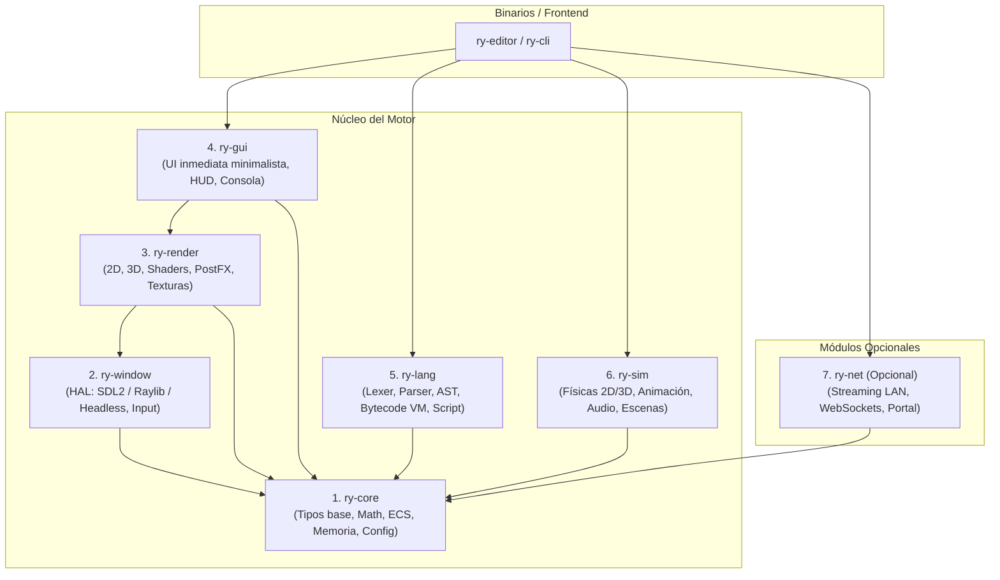
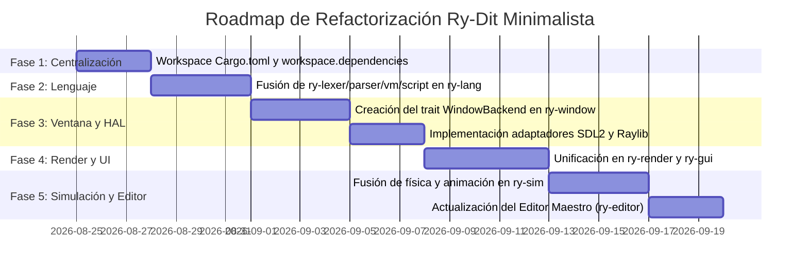

# 📐 Propuesta de Refactorización Masiva: Ry-Dit Minimalista, Compacto y Estable

**Fecha:** 2026-08-24  
**Objetivo:** Reducir la fragmentación arquitectónica de ~30 crates a 6–7 módulos cohesivos, estabilizar la capa de ventana/gráficos (SDL2 y Raylib mediante abstracciones limpias) y optimizar las dependencias para máxima eficiencia en Termux / Linux / Android.

---

## 1. 🔍 Diagnóstico del Estado Actual (v0.24.0)

Actualmente, el proyecto cuenta con más de **28 crates individuales** definidos en `crates/`:

```
crates/
├── blast-core, ry-core, ry-god, v-shield
├── ry-lexer, ry-parser, ry-vm, lizer, ry-script
├── ry-science, ry-physics, ry-anim
├── ry-backend, ry-gfx, ry3d-gfx, postfx-ry, ry-tilemap, ry-art
├── ry-windows, events-ry, ry-input
├── migui, toolkit-ry, ry-system-ry
├── ry-stream, ry-loader, ry-config
└── rybot, ry-rs, ry-editor
```

### Problemas Detectados:
1. **Hiper-fragmentación:** Crates de 100-300 líneas de código separados (ej. `ry-lexer`, `ry-parser`, `ry-vm`, `lizer`) aumentan el tiempo de compilación, la sobrecarga de metadatos de Cargo y la complejidad de mantenimiento en entornos de recursos limitados como Termux.
2. **Acoplamiento cruzado y duplicidad en Gráficos/Ventanas:**
   - `ry-backend`, `ry-windows`, `events-ry`, `ry-input`, `ry-gfx` compiten por la gestión de la ventana, contexto GL y captura de eventos.
   - Raylib y SDL2 están fuertemente entrelazados en múltiples crates en lugar de estar aislados tras una interfaz agnóstica.
3. **Inconsistencias de Workspace:**
   - Crates como `ry-art` y `ry-system-ry` existen en el sistema de archivos y son referenciados por `path`, pero no formaban parte explícita de `[workspace].members` en `Cargo.toml`.
4. **Dependencias dispersas:** Cada `Cargo.toml` declara versiones distintas de `serde`, `sdl2`, `raylib`, `gl`, etc., sin aprovechar `[workspace.dependencies]`.

---

## 2. 🏛️ Nueva Arquitectura Propuesta: *Ry-Dit "Hexa-Core"*

Se propone compactar el motor en **6 bloques fundamentales** más los binarios de entrada/editor:



---

## 3. 🔀 Matriz de Migración y Consolidación de Crates

| Crate Nuevo | Crates Actuales que Absorbe | Responsabilidad |
|---|---|---|
| **`ry-core`** | `ry-core`, `ry-config`, `blast-core`, `v-shield`, `ry-god` | Tipos primitivos, sincronización (`std::sync`), sistema de configuración `.rydit`, registro de módulos (`ModuleRegistry`), y utilidades matemáticas base. |
| **`ry-window`** | `ry-windows`, `events-ry`, `ry-input`, `ry-backend` (parte de ventana) | Capa de abstracción de hardware (HAL). Creación de ventana, contexto OpenGL, captura de eventos de teclado/ratón/touch/gamepad y control del loop de eventos. |
| **`ry-render`** | `ry-gfx`, `ry3d-gfx`, `postfx-ry`, `ry-tilemap`, `ry-art`, `ry-loader` | Pipeline de dibujo 2D (sprites, shapes, tilemaps), primitivas 3D, shaders, post-procesado GL y carga de texturas/fuentes. |
| **`ry-gui`** | `migui`, `toolkit-ry`, `ry-system-ry` | Sistema de interfaz de usuario inmediata (Immediate Mode GUI), widgets de juegos (HUD, inventario, diálogos) y componentes de UI para el editor. |
| **`ry-lang`** | `ry-lexer`, `ry-parser`, `ry-vm`, `lizer`, `ry-script` | Pipeline completo del lenguaje RyDit: Tokenización, Parsing, Generación de Bytecode, Máquina Virtual y carga dinámica de scripts. |
| **`ry-sim`** (o `rybot`) | `ry-physics`, `ry-anim`, `ry-science`, `rybot` | Simulación física de cuerpos rígidos/partículas, curvas Bezier/interpolación de animación, orquestación de escenas y lógica de juego. |
| **`ry-net`** *(opcional)* | `ry-stream` | Servidor WebSocket LAN, streaming de frames y portal web embebido. |
| **`ry-editor`** | `ry-editor`, `ry-rs` | IDE / Taller interactivo consolidado y punto de entrada para ensamblar módulos. |

---

## 4. 🪟 Abstracción Agnóstica de Ventana y Gráficos (SDL2 + Raylib)

Para desacoplar por completo la dependencia rígida de una librería específica de C/C++, `ry-window` y `ry-render` utilizarán **Traits** agnósticos.

### 4.1. Trait de Ventana (`ry-window`)

```rust
pub enum WindowEvent {
    Quit,
    Resized { width: u32, height: u32 },
    KeyDown { key: KeyCode },
    KeyUp { key: KeyCode },
    MouseButton { button: MouseButton, pressed: bool, x: f32, y: f32 },
    MouseMotion { x: f32, y: f32, dx: f32, dy: f32 },
    Touch { id: u64, x: f32, y: f32, phase: TouchPhase },
}

pub trait WindowBackend {
    fn init(config: &WindowConfig) -> Result<Self, WindowError> where Self: Sized;
    fn poll_events(&mut self) -> Vec<WindowEvent>;
    fn swap_buffers(&mut self);
    fn size(&self) -> (u32, u32);
    fn set_title(&mut self, title: &str);
    fn should_close(&self) -> bool;
    fn get_proc_address(&self, procname: &str) -> *const std::ffi::c_void;
}
```

### 4.2. Implementaciones Conmutables mediante Features de Cargo

En `crates/ry-window/Cargo.toml`:

```toml
[package]
name = "ry-window"
version = "0.1.0"
edition = "2021"

[features]
default = ["backend-sdl2"]
backend-sdl2 = ["dep:sdl2"]
backend-raylib = ["dep:raylib"]
backend-headless = []

[dependencies]
ry-core = { path = "../ry-core" }
sdl2 = { version = "0.37", features = ["ttf", "image"], optional = true }
raylib = { version = "5.5.1", default-features = false, features = ["nobuild"], optional = true }
```

### 4.3. Ventajas de esta Arquitectura:
- **Zero-cost switching:** Si compilas con `--features backend-sdl2`, el binario solo enlaza SDL2 sin cargar Raylib.
- **Portabilidad Android/Termux:** SDL2 posee excelente estabilidad y control en Termux con X11/Wayland/PulseAudio. Raylib puede activarse cuando se necesite prototipado 3D rápido.
- **Modo Headless / Tests automatizados:** Se pueden ejecutar tests y simulaciones de física/scripts en CI o consola sin abrir ventanas ni requerir servidor gráfico.

---

## 5. 📦 Estandarización de Dependencias con `[workspace.dependencies]`

Para evitar conflictos de versiones y reducir el tiempo de compilación y memoria RAM en Termux, se centralizan todas las dependencias en la raíz `Cargo.toml`:

```toml
[workspace]
resolver = "3"
members = [
    "crates/ry-core",
    "crates/ry-window",
    "crates/ry-render",
    "crates/ry-gui",
    "crates/ry-lang",
    "crates/ry-sim",
    "crates/ry-net",
    "crates/ry-editor",
]

[workspace.dependencies]
# Dependencias internas del motor
ry-core = { path = "crates/ry-core" }
ry-window = { path = "crates/ry-window" }
ry-render = { path = "crates/ry-render" }
ry-gui = { path = "crates/ry-gui" }
ry-lang = { path = "crates/ry-lang" }
ry-sim = { path = "crates/ry-sim" }
ry-net = { path = "crates/ry-net" }

# Dependencias externas compartidas
serde = { version = "1.0", features = ["derive"] }
serde_json = "1.0"
gl = "0.14"
image = { version = "0.25", default-features = false, features = ["png", "jpeg"] }
ab_glyph = "0.2"
rand = "0.8"
tungstenite = "0.21"

# Backends nativos opcionales
sdl2 = { version = "0.37" }
raylib = { version = "5.5.1", default-features = false, features = ["nobuild"] }

# Optimización extrema para compilación en dispositivos móviles / Termux
[profile.dev]
debug = false
opt-level = 1
incremental = true
codegen-units = 1

[profile.release]
opt-level = "z"
lto = true
panic = "abort"
strip = true
```

---

## 6. 🚀 Plan de Implementación por Fases (Roadmap de Refactor)



### Pasos recomendados:
1. **Fase 1: Preparar `[workspace.dependencies]`:**
   - Centralizar versiones en el `Cargo.toml` raíz.
2. **Fase 2: Consolidar `ry-lang`:**
   - Unir `ry-lexer`, `ry-parser`, `ry-vm`, `lizer` y `ry-script` bajo un solo crate `ry-lang` con submódulos internos (`lexer/`, `parser/`, `vm/`, `compiler/`).
3. **Fase 3: Crear `ry-window`:**
   - Crear el HAL de ventana con traits limpios y aislar `sdl2` y `raylib` bajo features condicionales.
4. **Fase 4: Consolidar `ry-render` y `ry-gui`:**
   - Unir pipeline 2D/3D en `ry-render` y compactar `migui` + `toolkit-ry` en `ry-gui`.
5. **Fase 5: Consolidar `ry-sim` y limpiar crates obsoletos:**
   - Mover físicas, partículas y matemáticas avanzadas a `ry-sim`.
   - Eliminar directorios de crates redundantes.
